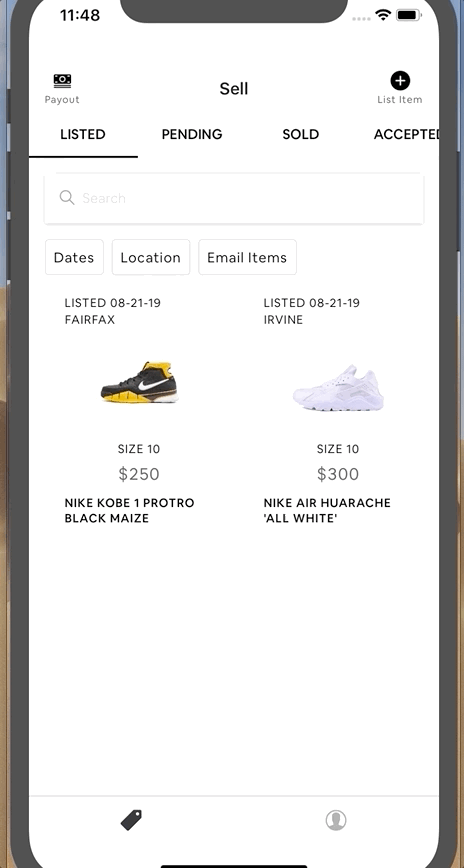

# React Native Connectivity Banner
* A simple React Native Component that leverages [@react-native-community/netinfo](http://https://github.com/react-native-community/react-native-netinfo "@react-native-community/netinfo") to display a banner alerting users when no or slow connection is detected.

### Demo
#### For 2G & 3G Connection


#### For No Connection


### Install the Package
Use NPM or Yarn
```sh 
yarn add @quantfive/react-native-connectivity-banner
```

```sh 
npm install --save @quantfive/react-native-connectivity-banner
```

### Usage
1. Require @quantfive/react-native-connectivity-banner after installation
```js 
import { ConnectivityBanner } from '@quantfive/react-native-connectivity-banner'
```

2. Insert the component into your code
```js
render() {
  return (
    <View> 
      <ConnectivityBanner />
    </View>
  )
}
 ```

### Main Options
| Option  |Type   |Description   |
| ------------ | ------------ | ------------ |
|interval   | Integer  | In milliseconds, determines how often the component will check the state of the device's connection. Defaults to 2000ms.  |
|messages   |Object   | ```js { notConnected: String, lowConnectivity: String}``` Customize the message you want to display to users |
|styleOverride   |  Object | Pass a style object to override or customize component's style   |
